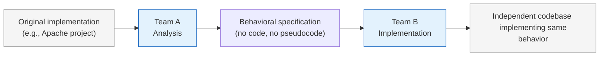
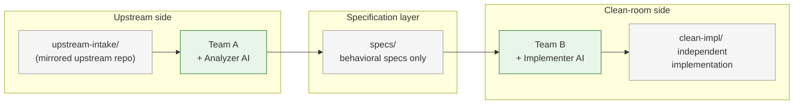
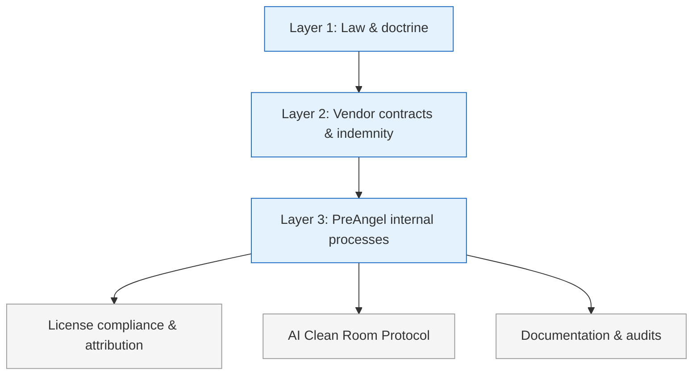

> Google Gemini CLI is Apache 2.0. Can we just fork it, rename it, ship it as our own commercial product, and say we *own* it?

This whole playbook started with what looked like a very straightforward idea:

## 0. The rabbit hole: from “simple fork” to “who owns this code?”

On paper, the answer is: **yes, mostly**.

Apache 2.0 lets you:

* fork the code,
* rebrand it under your own name,
* modify it as much as you like,
* sell it as a closed-source product if you want.

As long as you:

* keep the Apache 2.0 license text,
* preserve copyright and NOTICE information,
* mark modified files as modified,
* respect trademarks (no pretending you’re Google or “official Gemini”).

That’s enough to build a perfectly legitimate **PreAngel-branded fork** of an Apache project.

But then the question got more ambitious:

> “What if we don’t just want a fork. What if we want the **source code itself** to be truly ours — something we can honestly say we authored, not just ‘modified from Google’? And can AI help us do that?”

That’s where the rabbit hole begins:

1. **Fork & rebrand** → comfortably allowed under Apache.
2. **Make the whole codebase “ours”** → now we’re talking about derivative works vs independent creation.
3. **Classic clean-room engineering** → separate teams, one reads the original, the other implements from a spec.
4. **AI clean room** → can AI play those roles instead of humans?
5. **Training contamination** → but wait, Copilot / Claude / Gemini are all trained on GitHub already. What does that mean legally?
6. **Big tech precedents** → how Microsoft, OpenAI, Google, Anthropic, Amazon actually handle this in 2025.

This playbook is the result of following that chain all the way down.

---

## 1. From Apache fork to “can we own this?”

### 1.1 What Apache 2.0 actually gives you

Apache 2.0 is a **permissive license**. Very roughly, it says:

* You can use, modify, redistribute, and **commercialize** the code.
* You get a **copyright license** and a **patent license**.
* You must keep the license text and attribution.
* You must **mark modified files** as modified.
* You **do not** automatically get any trademark rights.

So for an Apache-licensed Gemini CLI:

* ✅ You can create `preangel-gemini-cli` (or a totally new name) and ship it as a commercial product.
* ✅ You can add lots of features and keep them closed-source.
* ❌ You cannot claim you wrote Google’s original code.
* ❌ You cannot use Google or Gemini trademarks as if they were yours.

In practice, a simple, compliant fork might:

* keep the original headers at the top of each file,
* add a one-line notice like `// Modified by PreAngel LLC.` to files you touch,
* keep a `NOTICE` file that credits the original project,
* and build your commercial story around your **extensions**, not around pretending the entire codebase is “greenfield PreAngel IP.”

### 1.2 When you want more than a fork

The moment you say:

> “I want to treat this as *my* code, not just a fork,”

you’ve crossed from **license compliance** into **copyright doctrine**:

* What counts as a **derivative work**?
* When is an implementation **independent** vs **based on** the original?
* How much similarity is too much?

Courts don’t use a simple percentage. There’s no rule like “under 30% similarity is fine.”

Instead, they look at things like:

* **Access**: Did you see the original code?
* **Substantial similarity**: Does your code copy expressive details (structure, comments, variable names, unusual choices), not just generic algorithms?

If you start from their file, read it, and tweak it line by line, you are almost certainly producing a **derivative work**, even if you change a lot.

If you want something you can plausibly call **independent**, you need a different process.

---

## 2. Classic clean-room engineering (the human version)



Before AI, the standard way to get “independent but compatible” code was the **clean-room** pattern. Think of cases like BIOS clones and compatibility layers.

The pattern looks like this:

1. **Team A – Analysis team**

   * Reads the original code.
   * Writes a **specification**: behavior, APIs, constraints, error cases.
   * Crucially: they do **not** send any code or code-like pseudocode across the wall.

2. **Team B – Implementation team**

   * Only sees the spec.
   * Never sees the original code.
   * Implements from scratch based on the spec.

3. **Evidence**

   * The company keeps documents showing:

     * who saw the original code,
     * what the spec contained,
     * how Team B worked.
   * If there is a dispute, they can show the court: “We used the ideas and behavior, not the expressive details.”

The core legal idea: **copyright protects expression, not ideas.**

* Team A is allowed to study the original expression.
* The spec distills it into **ideas and requirements**.
* Team B works only from those ideas.

If the process is clean and well-documented, Team B’s code can be argued to be **independent**, even if it implements the same behavior.

---

## 3. The AI twist: can we run clean room with agents instead of humans?

Enter 2025.

We now have:

* AI coding agents like **Claude Code**, **GitHub Copilot**, **Gemini Code Assist**, **Amazon Q Developer / CodeWhisperer**.
* General-purpose LLMs that:

  * can read code,
  * can summarize behavior,
  * can implement new code from a spec.

So the natural question is:

> “Can we do **clean-room** with AI as Team A and Team B?”

Conceptually, yes. AI is a tool. The law doesn’t care whether a human or an AI generated the text; it cares **what information flowed from the original code into the final implementation**.

That leads to the **AI Clean Room Protocol**.

---

## 4. The PreAngel AI Clean Room Protocol (v0.1)



This is a hypothetical, but concrete, protocol we can use when we genuinely want a component to be **independent of an upstream codebase**, not just a fork.

### 4.1 Roles and repositories

We separate three logical repositories:

1. `upstream-intake/`

   * Mirror of the upstream project (e.g., `google-gemini/gemini-cli`).
   * **Only Team A** (and its AI tools) can access this.

2. `specs/`

   * Contains **natural-language specifications**: behavior, APIs, constraints, test cases.
   * No code, no pseudocode.
   * Accessible to both Team A and Team B.

3. `clean-impl/`

   * The clean-room implementation.
   * **Only Team B** (and its AI tools) can write here.
   * No direct access to `upstream-intake/`.

Logically, we also split people and agents into two teams.

#### Team A – Analysis / Spec (“contaminated side”)

* Humans: Spec engineers.
* AI: Analyzer model (e.g. Claude Code or similar), allowed to see original code.
* Access:

  * ✅ `upstream-intake/` (full upstream code).
  * ✅ `specs/` (to write specs).
  * ❌ `clean-impl/` (no direct writes).

Goal: **Produce a code-free spec.**

#### Team B – Implementation (“clean side”)

* Humans: Implementation engineers.
* AI: Implementer model (e.g. Gemini, Claude, OpenAI, whatever we pick for this role) configured to never see upstream code.
* Access:

  * ✅ `specs/`.
  * ✅ `clean-impl/`.
  * ❌ `upstream-intake/`.

Goal: **Implement behavior from the spec, not from upstream code.**

### 4.2 Phase 1 – Upstream analysis (Team A)

Team A’s job is to read upstream and distill **behavior**, not code.

A prompt for the Analyzer AI might look like:

```text
You are acting as a clean-room spec writer.

You MAY read and analyze the following source code from an Apache-licensed project.

Your task:
- Produce a SPECIFICATION ONLY.
- Describe behavior, inputs, outputs, constraints, edge cases, and performance expectations.
- You MUST NOT output:
  - any original code or code fragments,
  - pseudocode that mirrors the original structure,
  - direct copies or close paraphrases of code comments,
  - internal identifiers that are not part of the public API.

Output format:
- Overview
- Public interfaces (CLI commands / APIs)
- Behavior by scenario
- Error handling
- Non-functional requirements
- Example test cases

If unsure whether something is “too close to the code”, do NOT include it.
```

Team A writes these specs into `specs/`.

### 4.3 Phase 2 – Spec review & scrubbing

Before Team B sees anything, Team A does:

* **Human review**: remove any code-like fragments, suspiciously detailed pseudocode, or internal naming that feels too close to the original.
* **Automated linting** (optional): a script that flags likely code (keywords, braces, typical syntax) and forces a second look.

Only then is the spec merged into the `specs/` repo.

### 4.4 Phase 3 – Clean implementation (Team B)

Team B works **only** from `specs/`.

They configure their AI tools so that:

* The model can see:

  * `specs/` content,
  * existing code in `clean-impl/`.
* The model cannot:

  * fetch the upstream GitHub repo,
  * browse internal mirrors of that repo.

A prompt for the Implementer AI might look like:

```text
You are an implementation engineer working under a clean-room protocol.

You will be given ONLY a specification that describes the desired behavior.
You MUST NOT assume access to any original implementation.

Your task:
- Design and implement new code that satisfies the specification.
- Use idiomatic patterns for the chosen language and ecosystem.
- Do NOT attempt to reconstruct or guess the original code.
- Do NOT search for the original project or its source.

If the spec seems incomplete, ask for clarification on behavior, not on the upstream code.
```

Team B commits the resulting code into `clean-impl/`.

### 4.5 Phase 4 – Similarity & audit checks

To strengthen the story, we can:

* Periodically compare `clean-impl/` files to `upstream-intake/` using:

  * diff tools,
  * similarity scoring,
  * or even a third “Auditor AI” that flags suspicious similarities.
* If a region looks too close (e.g. long identical sequences), Team B refactors it while preserving behavior.

We also keep logs:

* Analyzer AI sessions and prompts.
* Implementer AI sessions and prompts.
* Git history for `upstream-intake/`, `specs/`, `clean-impl/`.

If needed, we can later reconstruct the story: who saw what, when, and how.

---

## 5. The “training contamination” problem


The clean-room story so far assumes a neat separation:

* Team A saw the upstream code.
* Team B did not.

But 2025 reality is messier.

Most general-purpose LLMs (including code models) have been trained on:

* large swaths of **public GitHub code**,
* books,
* documentation,
* web pages.

So even if Team B’s model never sees the specific Gemini CLI repo **during the project**, it might still have seen it during **pre-training**.

This raises uncomfortable questions:

* *“Is the model itself ‘contaminated’?”*
* *“If it emits code similar to upstream, is that our fault?”*

This is not unique to our clean-room thought experiment. It’s the same underlying issue for:

* **GitHub Copilot**,
* **Amazon CodeWhisperer / Amazon Q Developer**,
* **Anthropic Claude / Claude Code**,
* **OpenAI models (via API or ChatGPT)**,
* **Google Gemini / Vertex AI Codey / Gemini Code Assist**.

So how do the big players deal with this?

They use **three layers**:

1. Legal theory: argue that training on lawfully acquired data is **fair use** (in the US).
2. Technical controls: reduce **verbatim regurgitation** and near-copying.
3. Contractual shields: offer **indemnity** to customers for copyright claims about outputs.

Let’s walk through each.

---

## 6. How courts are starting to treat training data (Anthropic & Copilot)

### 6.1 Anthropic and fair use for training

In 2025, a key ruling in *Bartz v. Anthropic PBC* (Northern District of California) held that **training an LLM on lawfully acquired books is fair use**, describing the training process as “quintessentially” or “spectacularly” transformative.

* Ropes & Gray’s summary: [“From Books to Bots: Key Takeaways from the Anthropic Fair Use Decision for AI Developers”](https://www.ropesgray.com/en/insights/alerts/2025/06/from-books-to-bots-key-takeaways-from-the-anthropic-fair-use-decision-for-ai-developers)
* Authors Alliance: [“Anthropic Wins on Fair Use for Training its LLMs, Loses on Building a Central Library of Pirated Books”](https://www.authorsalliance.org/2025/06/24/anthropic-wins-on-fair-use-for-training-its-llms-loses-on-building-a-central-library-of-pirated-books/)
* White & Case: [“Two California District Judges Rule That Using Books to Train AI is Fair Use”](https://www.whitecase.com/insight-alert/two-california-district-judges-rule-using-books-train-ai-fair-use)

The nuance:

* **Training on lawfully acquired copies** → fair use.
* **Building a central library of pirated books** → not okay; Anthropic later agreed to a landmark $1.5B settlement over its use of pirated book datasets.

Coverage of the settlement:

* Reuters: [Anthropic to pay $1.5 billion to settle author class action](https://www.reuters.com/sustainability/boards-policy-regulation/anthropic-tells-us-judge-it-will-pay-15-billion-settle-author-class-action-2025-09-05/)
* AP: [Judge approves $1.5 billion copyright settlement between AI company Anthropic and authors](https://apnews.com/article/9643064e847a5e88ef6ee8b620b3a44c)

Takeaway for PreAngel:

> Courts are increasingly treating **training** as lawful if you acquire content properly, but they care about **how you got the data** in the first place.

### 6.2 GitHub Copilot litigation: most theories trimmed back

In *Doe v. GitHub, Inc.*, programmers sued GitHub, Microsoft, and OpenAI, arguing that:

* Copilot was trained on their GitHub code,
* and that both training and outputs violated their rights.

The case is ongoing, but early rulings have already:

* Dismissed **most** of the original claims (including broad DMCA theories),
* left only narrow issues (like specific DMCA §1202(b) claims) alive for further litigation.

Useful summaries:

* Skadden: [“Motion to Dismiss Ruling Provides Further Insight Into How Courts View AI Training Data Cases”](https://www.skadden.com/insights/publications/2024/02/motion-to-dismiss-ruling-provides-further-insight-into-how-courts-view-ai-training-data-cases)
* BakerHostetler: [“Doe v. GitHub, Inc.” overview](https://www.bakerlaw.com/the-copilot-litigation/)
* Legal.io: [“Judge Throws Out Majority of Claims in GitHub Copilot Lawsuit”](https://www.legal.io/articles/5516216/Judge-Throws-Out-Majority-of-Claims-in-GitHub-Copilot-Lawsuit)

The official plaintiff site: [githubcopilotlitigation.com](https://githubcopilotlitigation.com/)

Takeaway:

* So far, US courts are **not** embracing the theory that training on publicly available code is inherently unlawful.
* The precise boundaries (especially outside the US) are still evolving.

---

## 7. How big vendors manage *output* risk: filters + indemnity

Even if training is fair use, there’s still the risk that a model **outputs** something too close to a copyrighted work (e.g., a long verbatim code sequence).

To manage this, vendors do two things:

1. **Technical mitigation** – try not to regurgitate training data.
2. **Indemnity** – promise to defend and compensate paying customers if something goes wrong.

### 7.1 Microsoft & GitHub Copilot

Microsoft launched the **Copilot Copyright Commitment** in 2023:

* Microsoft blog: [“Copilot Copyright Commitment”](https://blogs.microsoft.com/on-the-issues/2023/09/07/copilot-copyright-commitment-ai-legal-concerns/)
* TechTarget: [“Microsoft Copilot Copyright Commitment explained”](https://www.techtarget.com/searchenterprisedesktop/tip/Microsoft-Copilot-Copyright-Commitment-explained)

Key points:

* Applies to paid Copilot services (not free consumer versions).
* Extends Microsoft’s existing IP indemnity to **copyright claims about AI outputs**.

GitHub’s own docs emphasize that **Copilot Business and Enterprise** customers get IP indemnification for **unmodified** Copilot suggestions:

* GitHub: [“Establishing trust in using GitHub Copilot”](https://resources.github.com/learn/pathways/copilot/essentials/establishing-trust-in-using-github-copilot/)

Under the hood, Copilot also uses **duplication detection filters** to avoid suggesting code that is too similar to public GitHub snippets.

Microsoft’s Azure OpenAI “Customer Copyright Commitment” documents similar safeguards and required mitigations:

* Microsoft Learn: [“Customer Copyright Commitment – Required Mitigations”](https://learn.microsoft.com/en-us/azure/ai-foundry/responsible-ai/openai/customer-copyright-commitment)

### 7.2 OpenAI – Copyright Shield & output indemnity

OpenAI announced **Copyright Shield** for ChatGPT Enterprise and qualifying API use:

* Proskauer: [“OpenAI’s ‘Copyright Shield’ Broadens User IP Indemnities”](https://www.proskauer.com/blog/openais-copyright-shield-broadens-user-ip-indemnities-for-ai-created-content)
* Magnusson: [“OpenAI’s Copyright Shield – Peace of Mind for Some”](https://www.magnussonlaw.com/publications/openais-copyright-shield-peace-of-mind-for-some-from-something/)

In OpenAI’s own Service Terms:

* The **output indemnity** clause explicitly says OpenAI will defend Enterprise customers against claims that their **use or distribution of outputs** infringes third-party IP.
* OpenAI policies: [Service Terms](https://openai.com/policies/service-terms/)

### 7.3 Google – Generative AI indemnified services

Google offers a two-part indemnity for certain generative AI services:

* Blog: [“Protecting customers with generative AI indemnification”](https://cloud.google.com/blog/products/ai-machine-learning/protecting-customers-with-generative-ai-indemnification)
* Terms: [“Generative AI Indemnified Services” list](https://cloud.google.com/terms/generative-ai-indemnified-services)

There are two pieces:

1. **Training data indemnity** – Google takes responsibility if someone claims that the way Google used training data to build certain models infringes IP.
2. **Output indemnity** – For some services (e.g., Gemini for Google Cloud, Vertex AI with certain models), Google indemnifies customers for copyright claims about the outputs.

Google also documents how Gemini models handle customer data, including zero-data-retention options and caching behavior:

* Vertex AI docs: [“Vertex AI and zero data retention”](https://docs.cloud.google.com/vertex-ai/generative-ai/docs/vertex-ai-zero-data-retention)

### 7.4 Amazon CodeWhisperer / Amazon Q Developer

Amazon’s code assistant story evolved from **CodeWhisperer** into **Amazon Q Developer**, but the core posture is similar:

* CodeWhisperer GA announcement: [“Amazon CodeWhisperer, Free for Individual Use, is Now Generally Available”](https://aws.amazon.com/blogs/aws/amazon-codewhisperer-free-for-individual-use-is-now-generally-available/)
* DevOps blog: [“Optimize software development with Amazon CodeWhisperer”](https://aws.amazon.com/blogs/devops/optimize-software-development-with-amazon-codewhisperer/)

Amazon distinguishes between:

* **Individual / free tiers** – no IP indemnity.
* **Professional / paid tiers** – include enterprise features and IP protections; Amazon has public messaging that Professional users with filters enabled receive IP indemnity for generated code.

More pricing & tier discussion:

* AWS: [Amazon Q Developer pricing](https://aws.amazon.com/q/developer/pricing/)
* Third-party analysis: [“CodeWhisperer: Features, pricing, and enterprise considerations”](https://www.tabnine.com/blog/codewhisperer-features-pricing-and-enterprise-considerations/)

---

## 8. The PreAngel.AI IP Risk Playbook


> ### Sidebar: For General Counsel / Outside Counsel
>
> **Working summary of PreAngel’s posture**
>
> 1. **We assume training on lawfully acquired data is generally lawful, but we do not self-train on pirated corpora.** Our default posture tracks emerging US case law (e.g., Anthropic) while avoiding obvious data-acquisition risks.
> 2. **Where feasible, we shift output copyright risk to major vendors.** For Copilot / OpenAI / Google / Anthropic / AWS, we prefer enterprise or business tiers with IP indemnity and required filters enabled.
> 3. **We treat most upstream open-source as licensed derivatives, not “ours.”** For permissive licenses (Apache, MIT, BSD), we preserve attribution, follow NOTICE requirements, and mark modified files. We only claim authorship over our contributions.
> 4. **We reserve “clean-room independence” for targeted components.** Where independence matters (e.g., strategic subsystems, transaction-sensitive modules), we can invoke an AI-assisted clean-room protocol with separated roles, repos, and logged prompts.
> 5. **We document decisions and are prepared to cooperate in diligence.** For high-stakes scenarios (M&A, financing, outbound licensing), we can produce: (a) repo structure, (b) license/NOTICE inventory, (c) clean-room reports for specific components, and (d) a list of AI vendors, tiers, and indemnity terms relied upon.
>
> This blog post should be read as an engineering- and product-facing articulation of that posture. Any binding implementation for PreAngel would be captured in internal policies and updated in consultation with counsel.



So what does all this mean for a small but ambitious builder like PreAngel?

Here’s how we translate Big Tech’s strategy into a practical playbook.

### 8.1 Three layers of defense

We’ll think in the same three layers:

1. **Law & doctrine** – how courts are trending.
2. **Vendor contracts & indemnity** – where we can shift risk.
3. **Our own processes** – where we can reduce risk and be good open-source citizens.

#### Layer 1 – Law

* Training on lawfully acquired data is increasingly treated as **fair use** (in the US (Anthropic decisions, etc.), but data acquisition and piracy matter a lot.
* Training and outputs are being litigated (Copilot, Meta, Anthropic, OpenAI), but courts so far are trimming back the most aggressive theories.

We can’t control this layer, but we can **pay attention** and avoid obviously bad practices (e.g., using pirated datasets).

#### Layer 2 – Vendor contracts

Whenever we use third-party models (Copilot, Claude, Gemini, OpenAI, Amazon, etc.), we:

* Prefer **enterprise / business tiers** that:

  * don’t train on our private data by default, and
  * include explicit **IP indemnity for outputs**.
* Turn on their recommended **filters / duplication detection**.
* Check the terms for:

  * what’s covered (just outputs, or training data too?),
  * what conditions we must meet (filters on, no reverse-engineering, etc.).

This effectively says:

> “If there’s a copyright fight about what the model wrote, we want the vendor on the hook, not just PreAngel alone.”

#### Layer 3 – Our own behavior

This is where the AI Clean Room Protocol and Apache attribution rules live.

### 8.2 When we’re okay with forks & derivative works

For many projects (like an Apache-licensed Gemini CLI fork), we don’t need a clean-room at all. We just need to **comply with the license and be honest**.

Our default for Apache code:

1. Keep the upstream `LICENSE` and `NOTICE`.

2. Preserve upstream copyright headers.

3. Add a simple line to any file we modify:

   ```text
   // Modified by PreAngel LLC.
   ```

4. In docs, say something like:

   > “This project is a fork of the Apache-licensed `google-gemini/gemini-cli`, extended and maintained by PreAngel.”

Here, our value is:

* the features we add,
* the UX we polish,
* the integrations we build,
* the support we provide.

We **don’t** need to pretend that every line is original.

### 8.3 When we want clean-room independence

For a smaller set of components where we truly want an **independent implementation**, we can invoke the **AI Clean Room Protocol**:

* Use separate repos (`upstream-intake/`, `specs/`, `clean-impl/`).
* Keep Team A and Team B logically separated.
* Use AI for:

  * spec writing (Team A),
  * implementation (Team B),
  * auditing (optional third agent).
* Log everything: prompts, responses, commit history.
* Periodically audit for suspicious similarities and refactor.

This doesn’t magically remove all legal uncertainty—especially around training data—but it gives us a **coherent, documented story** about how specific components were built.

### 8.4 The PreAngel AI IP Risk Checklist

For any new project, we can run through this simple checklist:

1. **What’s the starting point?**

   * Pure greenfield?
   * Fork of an Apache / MIT / BSD project?
   * Something with a stricter copyleft license (GPL, AGPL)?

2. **Do we need clean-room, or is a licensed fork enough?**

   * If a fork is fine → follow the license, credit upstream, focus on building features.
   * If we want independence → invoke the AI Clean Room Protocol for that component.

3. **Which AI tools are we using? Are we covered?**

   * Prefer enterprise/paid tiers with IP indemnity and training controls (Copilot Business/Enterprise, ChatGPT Enterprise/API, Gemini Enterprise, Claude business offerings, Amazon Q Developer Pro, etc.).
   * Ensure filters / duplication detection are enabled where required.

4. **Are we good open-source citizens?**

   * Respect licenses and NOTICE files.
   * Don’t strip attribution.
   * When in doubt, over-credit rather than under-credit.

5. **Do we need legal advice?**

   * For high-stakes scenarios (big deals, acquisitions, or contentious forks), we involve actual IP counsel.

---

## 9. Conclusion: Building boldly, but not blindly

AI has made it incredibly easy to:

* read huge codebases,
* summarize behavior,
* generate new implementations,
* and remix ideas at scale.

It has **not** changed the basics of copyright:

* Expression is protected.
* Ideas and behavior are not.
* Training on lawfully acquired data is increasingly seen as fair use, but datasets and outputs still matter.

What *has* changed is the tooling and the risk landscape:

* Big vendors (Microsoft, GitHub, OpenAI, Google, Anthropic, Amazon) are building a stack of **fair-use arguments + filters + indemnity**.
* Courts are slowly sketching the boundaries: Anthropic’s fair use win for training, Copilot’s partially dismissed claims, massive book settlements around pirated datasets.

PreAngel doesn’t need to solve global AI copyright law on its own.

Instead, we can:

1. **Lean on vendor indemnity and controls** where it makes sense.
2. **Respect open-source licenses** and over-credit upstream.
3. Use the **AI Clean Room Protocol** when we genuinely want independent implementations.
4. Keep our processes and decisions **documented and auditable**.

That combination lets us do what we actually care about:

> Build ambitious, AI-native products with a clear conscience and a clear paper trail.

The law will keep evolving. So will the models. This playbook is our snapshot for 2025—a living document we can refine as new cases, tools, and patterns emerge.

And if nothing else, it’s a reminder that every “simple” question like:

> “Can I just fork this CLI and call it mine?”

can turn into a surprisingly deep tour of modern AI, copyright law, and how to be a good citizen in the multiverse of code.

---

**Disclaimer:** This post describes an engineering- and product-oriented IP risk framework for working with AI systems. It is not legal advice. Organizations should consult qualified counsel before relying on any of these patterns in production or in high-stakes transactions.
